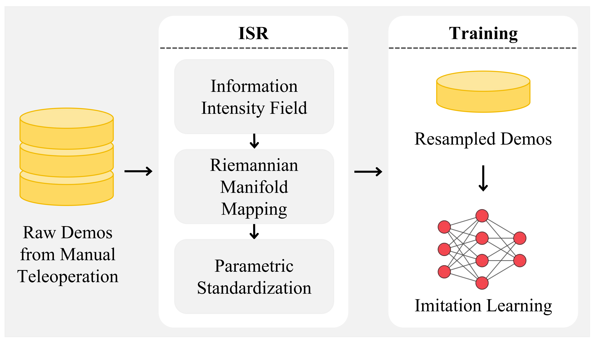

<h1 align="center">Improving Robotic Imitation Learning via Trajectory Standardization</h1>

<p align="center">
  Licheng Yang<sup>1,2</sup>, Lingfeng Qian<sup>2</sup>, Fei Zheng<sup>2</sup>,
  Yonghao He<sup>2&dagger;</sup>, Wei Sui<sup>2</sup>,
  Shuangshuang Li<sup>1</sup>, Hu Su<sup>1*</sup>
</p>

<p align="center">
  <sup>1</sup>State Key Laboratory of Multimodal Artificial Intelligence Systems (MAIS),
  Institute of Automation, Chinese Academy of Sciences<br>
  <sup>2</sup>D-Robotics<br>
  <sup>*</sup>Corresponding author  <sup>&dagger;</sup>Project lead
</p>

<p align="center">
  <a href="https://d-robotics-ai-lab.github.io/isr.page/" target="_blank">
    
  </a>
  <a href="https://arxiv.org/pdf/2606.22907" target="_blank">
    
  </a>
  <a href="https://arxiv.org/abs/2606.22907" target="_blank">
    
  </a>
</p>

## 🔥 Updates

- 2026.06.16: Our paper was accepted by the [2026 IEEE/RSJ International Conference on Intelligent Robots and Systems (IROS)](https://2026.ieee-iros.org/).

## 1. Introduction

<p align="center">
  
</p>

Information-Standardized Trajectory Resampling (ISR) is an offline preprocessing method for robotic imitation learning and a practical form of Trajectory Standardization. It resamples teleoperated demonstration trajectories into compact, information-consistent sequences by reducing low-motion redundancy while preserving high-curvature transitions and fine-manipulation phases.

## 2. Installation

```bash
python3 -m venv .venv
source .venv/bin/activate
python -m pip install --upgrade pip
python -m pip install -e .
```

## 3. Getting Started

### 3.1 Resample a single episode:

The example script assumes our episode JSON schema and a preprocessed episode
where every frame is valid. In `cli/resampling/resample_single_episode.py`,
`load_episode_arrays` extracts the action point/end-effector 3D coordinates,
timestamps, and an optional gripper value. For another JSON schema, write your
own extraction function before calling ISR. The extraction function must
provide `positions` with shape `[T, 3]` and aligned `timestamps` with shape
`[T]`. The `gripper` array with shape `[T]` is optional. When saving output,
the example scripts map selected trajectory positions back to the original
frame numbers using each frame's JSON `idx` field.

```bash
python3 cli/resampling/resample_single_episode.py \
  --data data/example_1.json \
  --output_json outputs/example_1/data.json \
  --d_target 0.05 \
  --lambda_dist 1.0 \
  --lambda_acc 0.01
```

### 3.2 Resample a dataset:

```bash
python3 cli/resampling/batch_resample.py \
  --input_dir datasets/task1 \
  --output_dir outputs/task1_isr \
  --d_target 0.05 \
  --lambda_dist 1.0 \
  --lambda_acc 0.01 \
  --log_path outputs/logs/task1/scale.json
```

Dataset directory structure under `datasets/`:

```text
datasets/task1/
├── episode_0000/
│   ├── data.json
│   ├── colors/
│   │   ├── head_camera/
│   │   └── wrist_camera/
│   ├── depths/
│   └── audios/
├── episode_0001/
│   ├── data.json
│   └── ...
├── ...
```

### 3.3 Visualization:

Open an interactive window:

```bash
python3 cli/visualization/visualize_traj.py \
  --original data/example_1.json \
  --resampled outputs/example_1/data.json
```

Save the visualization as an image:

```bash
python3 cli/visualization/visualize_traj.py \
  --original data/example_1.json \
  --resampled outputs/example_1/data.json \
  --save outputs/example_1/traj_compare.png
```

## 4. VLA/VA Model Fine-tuning

ISR resampling is applied to the robot state trajectory stored in the
`states` field of each episode `data.json`. After resampling, the selected
frames define the standardized trajectory used for downstream training.

For VLA/VA model fine-tuning in this work, the action targets are explicitly
synchronized with the resampled state representation: the per-frame `actions`
field is overwritten with the corresponding `states` field.

## Acknowledgement

The proposed ISR method is validated with
[pi0.5](https://github.com/Physical-Intelligence/openpi) and
[VO-DP](https://github.com/D-Robotics-AI-Lab/DRRM). We thank the authors for
their open-source contributions.

## License

This project is released under the [Apache License 2.0](LICENSE).

## 📝 Citation

If you use this code in your research, please cite our project:

```bibtex
@article{yang2026isr,
  title={Improving Robotic Imitation Learning via Trajectory Standardization},
  author={Licheng Yang and Lingfeng Qian and Fei Zheng and Yonghao He and Wei Sui and Shuangshuang Li and Hu Su},
  year={2026},
  eprint={2606.22907},
  archivePrefix={arXiv},
  primaryClass={cs.RO},
  url={https://arxiv.org/abs/2606.22907}
}
```
